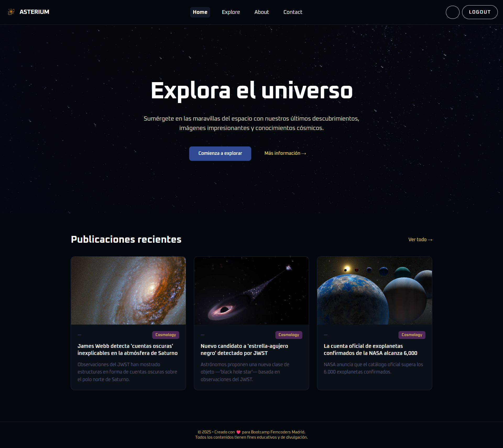

# **🌠 Asterium — Blog sobre Astronomía**

*“Explorando el universo, una publicación a la vez.”*

**Asterium** es una plataforma **full-stack** dedicada a la astronomía, el cosmos y la ciencia del universo. El proyecto combina artículos, imágenes, noticias y contenido generado por los usuarios para crear una comunidad interactiva de amantes del espacio.

El objetivo principal es **hacer que la astronomía sea accesible, inspiradora y visualmente atractiva**.


## **🌌 Descripción del Proyecto**


Asterium es un blog donde los usuarios pueden:

* Leer artículos sobre planetas, galaxias y descubrimientos.  
* Crear y publicar sus propias entradas.  
* Gestionar su perfil y actividad.

El diseño está inspirado en el cielo nocturno: tonos oscuros, detalles estelares, transiciones suaves y una tipografía moderna.

## **🧭 User Journey**

1. **Página principal** — flujo de artículos y secciones temáticas.  
2. **Registro / Inicio de sesión** — autenticación mediante formulario.  
3. **Perfil del usuario** — gestión del perfil y de las publicaciones.  
   **Crear artículo** — editor con soporte Markdown.  
4. **Ver artículo** — página limpia con contenido y sección de comentarios.

## **🎨 Prototipo en Figma**

El diseño sigue un estilo minimalista con enfoque en la lectura y la experiencia visual.

**¡Atención!** El prototipo en Figma puede diferir del diseño que tenemos como resultado.

Vistas: about us, post page, feedback page, register page, login page, create a new post page, profile page, search result page.

[**Enlace**](https:https://www.figma.com/design/kofeymVilSP9jyQ7k8P2Wx/Asterium?node-id=17-2&t=BqSRzoE0jWOoDuy3-1)

## **⚙️ Tecnologías**

### **🖥️ Frontend**

* ⚛️ **React \+ Vite**  
* 🎨 **TailwindCSS**  
* 🧭 **React Router**  
* 🔤 **Renderizado Markdown**  
* 🔧 **Axios** para solicitudes API

## **📁 Estructura del Proyecto (frontend)**

```bash 
/client  
  ├── src/  
  │   ├── assets/           # imágenes e íconos`  
  │   ├── components/       # componentes UI (Navbar, Card, Button)  
  │   ├── pages/            # vistas (Home, Article, Profile)`  
  │   ├── router/           # enrutamiento`  
  │   ├── services/         # conexión con API`  
  │   ├── store/            # estado global`  
  │   ├── validators/       # validaciones de formularios`  
  │   └── main.tsx
```

## **⚡ Instalación y Ejecución**

```bash 
# 1. Clonar el repositorio  
git clone https://github.com/Asterium360/Aster-Client.git`  
cd client

# 2. Instalar dependencia  
cd client && npm install  

# 3. Ejecutar el proyecto  
npm run dev  # ejecuta frontend en modo desarrollo
```

🛰️ Frontend → [http://localhost:5173](http://localhost:5173)  

## **🧪 Pruebas**

`npm run test`

Se prueban:

* Operaciones CRUD (posts, comentarios, usuarios)  
* Autenticación  
* Endpoints de la API

## **Gestión del Proyecto**
Мы использовали гитпроект для организации работы команды. 

## **👥 Equipo del Proyecto**

| Nombre | Rol | GitHub | LinkedIn |
| ----- | ----- | :---: | ----- |
| **Anngie** | Project Lead, Fullstack Developer | [link](https://github.com/angiepereir) | [link](https://www.linkedin.com/in/anngy-pereira-094aa026a/) |
| **Larysa** | Scrum Master, UI designer, Frontend Developer   | [link](https://github.com/ambalari) | [link](https://www.linkedin.com/in/larysa-ambartsumian/) |
| **Michelle**  | Frontend Developer | [link](https://github.com/MichelleGel) | [link](https://www.linkedin.com/in/michelle-gelves/) |
| **Maryori** | Backend Developer | [link](https://github.com/MaryoriCruz) | [link](https://www.linkedin.com/in/maryori-cruz-6b440116b/)  |
| **Sofia**  | Backend Developer | [link](https://github.com/Sofiareyes12) | [link](https://www.linkedin.com/in/sofiareyes12/) |


## **💬 Contacto**

* 💻 Página web:  
* ✉️ Correo electrónico: equipoasterium@gmail.com


**Proyecto realizado en Factoría F5 – Bootcamp FullStack & DevOps.
Diseñado con buenas prácticas de arquitectura, seguridad y documentación profesional.**